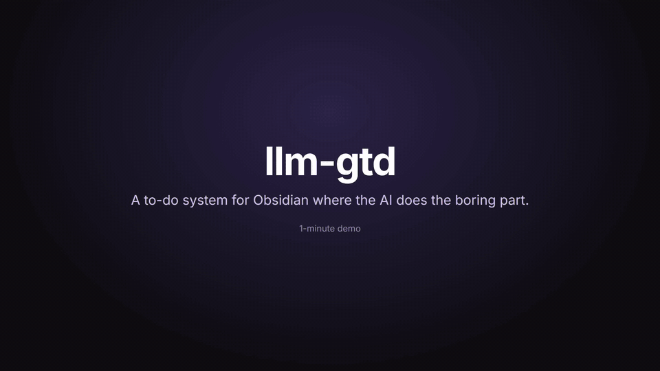
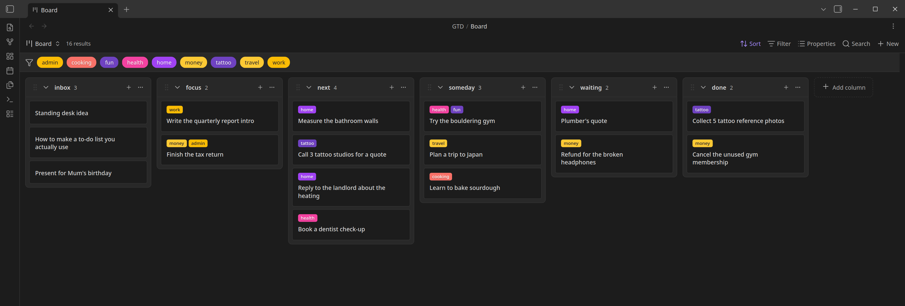
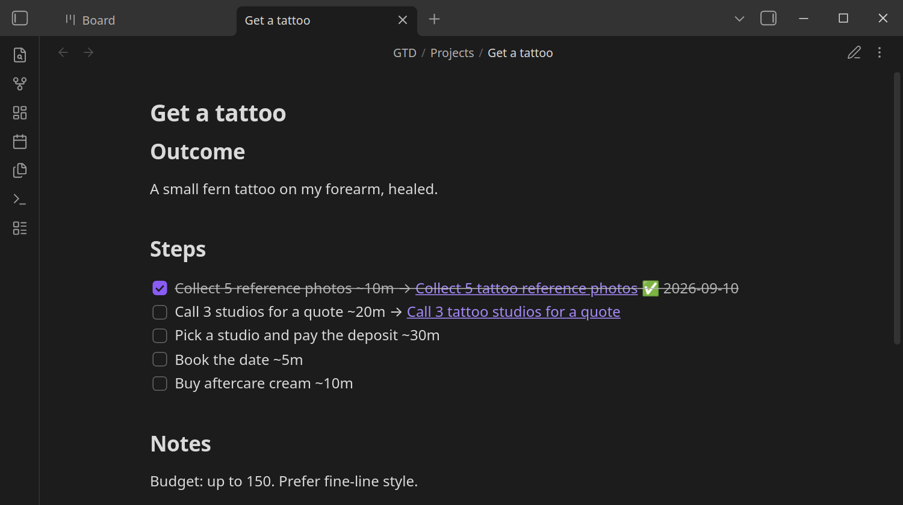

# llm-gtd

**A to-do system for Obsidian where the AI does the boring part.**

You dump thoughts in. Claude Code sorts, tags and files them. You just decide what to do.

[](docs/assets/demo.mp4)

*84-second demo. Click for the full-quality video.*

## Why it works for busy brains

- 🧠 **Capture takes seconds.** Drop a note or a web clip in the inbox. No sorting, no forms.
- 🧹 **Someone else does the admin.** Claude tags, files and cleans up — and asks before it changes anything.
- 🎯 **One next step, not twenty.** Big projects show only the step you can start today.
- 🔔 **Nothing rots quietly.** The weekly review points out what got stuck and suggests one way out.

It's inspired by the [llm-wiki idea](https://gist.github.com/karpathy/442a6bf555914893e9891c11519de94f):
**you capture and decide, the AI does the bookkeeping.**

## Get started

1. **Open a vault** in Obsidian (new or existing — your notes stay untouched).
2. **Install 2 plugins** (Settings → Community plugins): `Base Board` and `Templater`.
   `Base Board` needs Obsidian 1.10.2+.
3. **Run `claude` in the vault folder and paste this:**

   ```text
   Install llm-gtd in this vault.

   1. Download this file with curl and read all of it:
      https://raw.githubusercontent.com/cypiswhywhy/llm-gtd/main/install.md
      (Don't use a web-fetch tool. It summarizes.)
   2. Follow the prompt between its two `---` lines exactly,
      as if I had pasted it in.
   ```

4. **Flip one switch.** Settings → Templater → turn on *Trigger Templater on new file creation*, and
   add a Folder Template: `GTD/Items` → `Templates/GTD Item.md`.

Done. Open `GTD/Board.base` to see your board.



## Every day

| Type this | What happens |
|---|---|
| `/gtd-triage` | Empties the inbox: tags each item and suggests a column. |
| `/gtd-review` | Weekly check-up: stuck projects, stale cards, old done items archived. |
| `/gtd-project I want to have a tattoo` | Turns a big goal into small steps. Only the first step becomes a card. |
| `/gtd-update` | Pulls in the latest version of the system. |

To finish something, drag its card to **done**.

## Big things: projects

"Buy a flat" never gets started — it's a result, not an action. `/gtd-project` asks what *finished*
looks like, then writes small steps with time estimates into a note in `GTD/Projects/`.



- **Only the active step is on the board**, so it stays a list of things you can do today.
- **Run `/gtd-project` with no argument** to tick off finished steps and move the next one up.
- **Stalled for 14 days?** `/gtd-review` names the stuck step and suggests one fix: a sweep, a smaller
  step, `waiting` on someone, or letting it go.

## Coming from Notion

1. In Notion, export as **Markdown & CSV** (all rows).
2. Drop the zip into a `.gtd-import/` folder in your vault. No need to unzip. (Leaving it in
   `~/Downloads/` usually works too.)
3. Run `claude` in the vault folder and paste this:

   ```text
   Import my Notion export into this vault.

   1. Download this file with curl and read all of it:
      https://raw.githubusercontent.com/cypiswhywhy/llm-gtd/main/import-notion.md
      (Don't use a web-fetch tool. It summarizes.)
   2. Follow the prompt between its two `---` lines exactly,
      as if I had pasted it in.
   ```

It shows you how your Notion statuses map to the board and writes nothing until you say yes.
Long-finished items go straight to the archive, so the board opens clean.

<details>
<summary><b>What it adds to your vault</b></summary>

```
CLAUDE.md               # the rules the AI follows
GTD/Board.base          # kanban board + Inbox / Stale / All items views
GTD/Items/              # one note per item
GTD/Projects/           # one note per project — never a card
GTD/Archive/            # old done items
GTD/Attachments/        # files an import brought along (only if needed)
GTD/Log.md              # log of everything the AI did
Templates/GTD Item.md   # template for new items
clipper/                # Obsidian Web Clipper template
.claude/skills/         # gtd-triage, gtd-review, gtd-project, gtd-update
```

Nothing else in your vault is read, moved or changed. If a file already exists, it stops and asks.

</details>

<details>
<summary><b>What's in this repo</b></summary>

This isn't a plugin — it's a set of **prompts** for Claude Code. The snippets above fetch them for
you; you never need to open these files.

| File | Use it to |
|---|---|
| [`install.md`](install.md) | Set up a vault. |
| [`update.md`](update.md) | Upgrade a vault installed earlier. `/gtd-update` does this for you. |
| [`import-notion.md`](import-notion.md) | Move in from Notion or a CSV, once. |
| [`install.html`](install.html) | Read the installer as a web page with a copy button. |

`/gtd-update` checks this repo on every run, so installed vaults stay current. Maintainer notes
live in [`CLAUDE.md`](CLAUDE.md).

</details>
